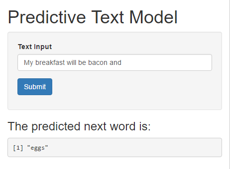

Predictive Text Model Application
========================================================
author: Rodrigo Rezende
date: August 25th, 2016
autosize: true

Background
========================================================

- Typing in the small keyboards of mobile phones is an unwieldy task for most people
- As people around the world are spending an increasing amount of time on their mobile devices for email, social networking, banking and a whole range of other activities, new instruments capable of
making the task of typing on mobile phones easier have become necessary
- Fortunately, using a number of modern tools from Artificial Intelligence, like Machine Learning for example, it is possible to develop applications that can help us in that task

Description of the Application
========================================================

- The Predictive Text Model Application is extremely simple to use, as can be seen in this snapshot
- Just start typing a sentence in the *Text Input* box and hit the Submit button
- The application will predict the most probable next word in the sentence

***

Description of the Algorithm
========================================================

- The algorithm predicts which is the most probable next word based on the last three words that have been already typed in the sentence. If there are only two, or even only one, word in the sentence, the algorithm makes its prediction based on this smaller set of words.
- The prediction is made using a dictionary that maps a huge number of groups of three words (called trigrams) to the word that most probably would come after each specific trigram. The process is exactly the same when making predictions based on groups of two words (bigrams) or one word (unigrams).

Description of the Algorithm (Cont.)
========================================================

- The dictionaries that are used to map each trigram, bigram or unigram to its most probable next word were created analyzing a data set of more than 4 million lines of text
- In order to define which is the most probable word after each trigram, the data set was analysed and all the possible trigrams that appeared in the texts were tabulated and the word that most frequently appeared after each trigram was then considered the most probable word and included in the dictionary. The process is exactly the same for bigrams and unigrams.
